# Matricás Album Architecture

Source of truth: this Markdown file with Mermaid diagrams.

HTML snapshot: `docs/architecture.html`. Keep it in sync with this Markdown when the browser-readable document is needed.

## Architecture Summary

The demonstrator separates planning from execution:

- `StickerResource` and `StickerVersion`: global reusable sticker/activity library. `StickerResource.ArchivedAt` hides resources from default pickers without losing history.
- Future-domain alias: architecturally, `StickerResource`/`StickerVersion` are reusable activity-card primitives. The current product bridges this for teachers as `Tevékenység (matrica)`: "matrica" remains the concrete album token and DB/API naming, while "tevékenység" is the newer product-planning language. There is no `ActivityResource` rename or Activity Studio UI.
- `AlbumTemplate` + `AlbumTemplateVersion`: a versioned reusable album plan. New templates land as `v1` with `IsDraft = true` and only become instantiable after Publikálás. Edits to a published template create or update an `AlbumTemplateVersion` draft (at most one draft per template, enforced by a partial unique index); the draft can be Publikálás-ed to become the next published version or Elvetés-ed. Each version owns its own pattern metadata (`PatternKey`, `PatternName`, `PatternDescription`), dispositions, units (`AlbumTemplateVersionWeekPlan`), differentiation paths, and sticker assignments. `AlbumTemplate.ArchivedAt` hides templates from the instance picker.
- `AlbumTemplate.DurationType` + `AlbumTemplateVersion.DurationType` (`het | ora | fazis`) labels the unit row type. The number of units is implicit from the rows in `album_template_version_week_plans`.
- `AlbumTemplatePatterns` currently allows three pedagogical patterns: `altalanos`, `produktiv-hibazas`, and `kutatas-bizonyitas`. The pattern picker seeds the first draft's unit structure, sticker order, and reflection prompts; later pattern metadata edits do not automatically rewrite an already-authored draft. In the progressive entry UI this appears as a secondary `Pedagógiai minta`, not as a hierarchy level.
- `AlbumInstance`: one classroom execution of a published template version, with teams, unit-title overrides, evidence, feedback, quality scores, closure checklist, team-level reflections, team help requests, team differentiation-path assignments, and instance-owned AI notes. The instance references both the legacy `AlbumTemplateId` and the specific `AlbumTemplateVersionId` it was minted from, so subsequent template versions don't disturb running instances.
- `InstanceSticker`: runtime copy of a template-assigned sticker for one instance. Its `State` is **lifecycle-only** (`tervezett | aktiv`) — teacher controls when the sticker opens for the album. `Deprecated = true` parks stickers removed by a template-version upgrade while preserving evidence.
- `InstanceStickerTeamProgress`: per-team submission state on an instance sticker (`varakozik | javitas | elkeszult | reflektalt`). "No row" means the team hasn't started yet. This is what the student-side UI reads to render team-specific banners and "done" lists.
- `InstanceStickerTeamDifferentiationPath`: teacher-chosen path assignment for one team on one runtime sticker (`tamogatott | alap | kihivas`). It records adaptation history without ranking teams.
- `Evidence`: a team's submission against an instance sticker. Carries `HelpRequested: bool` for structured student-side help signals.
- Weekly pilot observations are currently a frontend/localStorage bridge keyed by instance and unit. They can be merged into the persisted `TeacherEffectLog` during closure, but they are not backend entities yet.
- `AiAdvice` and `AiAdviceRun`: persisted AI advice plus audit trail generated through a separate Python/Agno service and the static methodology source-book `agent-wiki` projection. Advice is target-aware: general teacher advice, student Socratic questions, pending-evidence digest, help-request triage, create-sticker, draft-feedback, and closure synthesis all share the same persisted lifecycle.

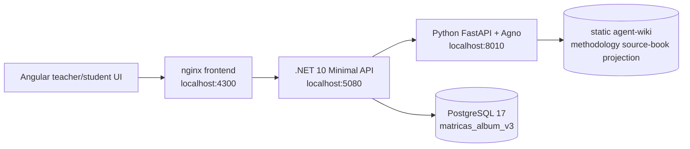

## Lauder Pilot Slice

The September-ready slice is deliberately narrower than the full album-platform vision. It proves that a teacher can organize existing Lauder stickers into usable units before asking the AI to invent pedagogy.

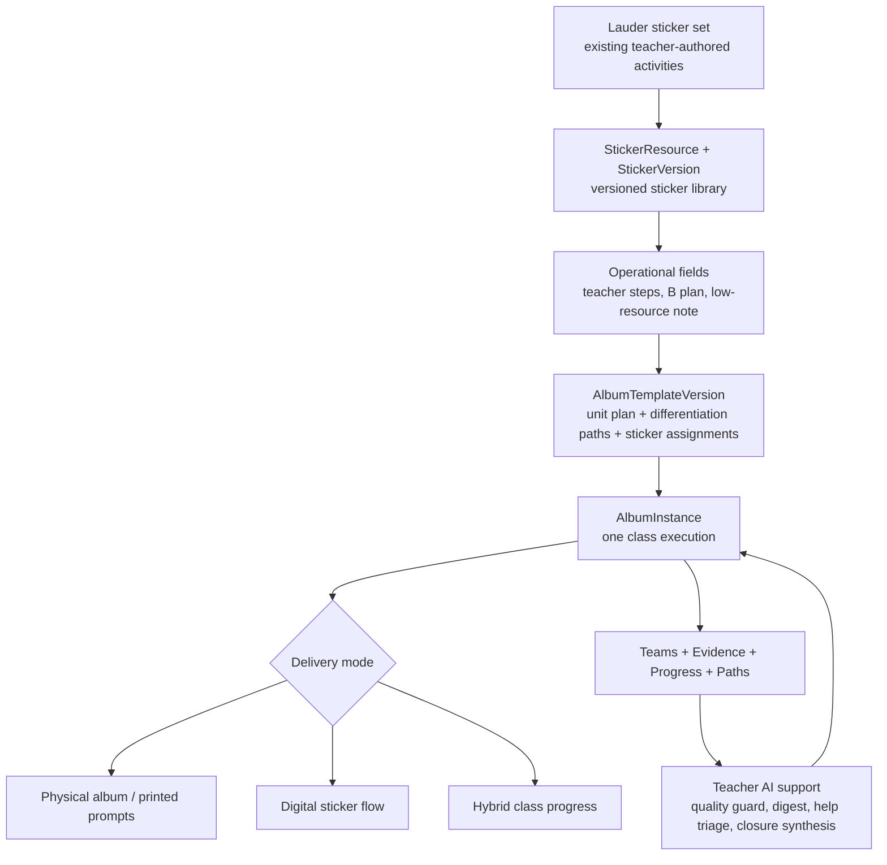

## Methodological Album Patterns

Album-minták are a lightweight pedagogical starting point for teachers. The teacher still creates an `AlbumTemplate`; the selected pattern only preconfigures the first draft with a methodology-specific title, unit type, unit sequence, starter stickers, and reflection prompts.

The current seed set is intentionally small:

| Pattern key | Teacher-facing name | Default shape |
| --- | --- | --- |
| `altalanos` | Általános album | Neutral project-album frame using the existing starter sticker set. |
| `produktiv-hibazas` | Produktív hibázás | Phase-based album (`DurationType = fazis`) with challenge, first strategy, dead-end analysis, consolidation, and retry stickers. |
| `kutatas-bizonyitas` | Kutatás-bizonyítás | Inquiry/CER flow with question, hypothesis, data, claim, evidence, reasoning, and revision stickers. |

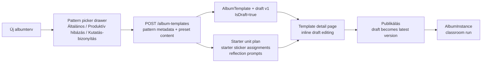

Important boundary: this is not a method marketplace or generalized activity platform in v1. The domain language stays `AlbumTemplate`, `StickerVersion`, `AlbumInstance`, `Evidence`, `Feedback`, and `Reflection`.

## Product Hierarchy Mapping

The 2026-05-29 product plan introduces a broader planning hierarchy:

`Tanterv -> Modul -> Témakör -> Tanulási egység -> Blokk -> Tevékenység`

Foundation decision: `Témakör` is first-class and contains `Tanulási egység`. The current implementation should be treated as a compatibility layer until a later schema slice.

The recursive Confluence re-check found one source mismatch that matters before schema work: `3. Rendszerstruktúra és alapfogalmak` still lists the hierarchy without `Témakör`, while later topic pages, creation pages, and product decisions treat `Témakör` as a first-class level. Until the source is reconciled, implementation stays aligned with the locked hierarchy above and avoids introducing `Topic` / `LearningUnit` schema objects.

Current-to-target mapping:

| Target concept | Current implementation | Mapping stance |
| --- | --- | --- |
| `Tanterv` | No dedicated entity yet | Future top-level planning container. Do not add `Curriculum` until a later schema slice. |
| `Modul` | No dedicated entity yet | Future larger thematic/program unit. Do not add `Module` until hierarchy ownership and navigation are scoped. |
| `Témakör` | No dedicated entity yet | Future first-class level between `Modul` and `Tanulási egység`. Do not model as a tag or label in the current slice. |
| `Tanulási egység` | `AlbumTemplateVersionWeekPlan`, `AlbumInstanceWeekPlan`, `DurationType`, `Week` / `WeekNumber` | Current temporary operational unit structure. Keep existing names until the schema slice explicitly handles compatibility. |
| `Blokk` | No dedicated entity yet | Future lesson/block composition layer. For now, lesson starts save through `AlbumTemplateVersion` unit rows and final-product notes. |
| `Tevékenység` | `StickerVersion` plus `StickerVersionTeacherStep` | Current reusable activity-card primitive. Use `Tevékenység (matrica)` as the teacher-facing bridge while DB/API names stay unchanged. |
| Classroom execution | `AlbumInstance`, `InstanceSticker`, teams, evidence, progress, feedback, reflections | Current running-album layer remains the execution model until the hierarchy is explicitly introduced. |

Working metadata ownership hypothesis for future filter/schema work:

| Target concept | Metadata ownership stance |
| --- | --- |
| `Tanterv` | Owns broad subject/grade scope, year-level intent, and later print/export package context. |
| `Modul` | Owns the larger thematic arc and module-level learning outcomes across multiple topics. |
| `Témakör` | Owns the conceptual topic, NAT/kerettanterv links, and topic-level competency emphasis. |
| `Tanulási egység` | Owns the weekly/unit learning focus, success criteria, and the ordered set of blocks. |
| `Blokk` | Owns lesson/block composition: timebox, 3-5 activities, required/optional/extra participation, tools/resources, reflection prompt, and alternative path. |
| `Tevékenység` | Owns activity-card metadata: fixed activity type, interaction mode, participant mode, estimated minutes, evidence type, student choice, and real-world/home/community context. |

Deferred schema guidance:

- Do not introduce `Curriculum`, `Module`, `Topic`, `LearningUnit`, or `Block` entities in the current compatibility layer.
- Do not rename `Week`, `WeekNumber`, or `CurrentWeek` to `UnitIndex` before migration strategy is scoped.
- Do not force teachers to manage the full hierarchy before they can create or run an activity.
- Do not rename the product to `ActivityStudio` or rename DB/API resources to `ActivityResource` in the pilot.
- Do not build structured filtering or adaptation logic on text notes saved into existing fields; those notes are a no-regression bridge only.

Regression guardrails:

- Template versioning remains stable: published versions stay immutable for already running albums, and drafts remain draft-only until `Publikálás`.
- Running instances stay bound to the exact `AlbumTemplateVersionId` they were minted from.
- Template-version upgrade continues to preserve evidence by exact `StickerVersionId`, then same `StickerResourceId` fallback.
- Evidence, progress, help requests, and team reflections stay attached to runtime stickers and teams.
- Differentiation paths continue to express teacher adaptation without ranking teams.
- Closure synthesis remains descriptive and teacher-facing; no automated effectiveness score or AI decision-making.
- No `agent-wiki` or AI prompt projection change is implied by hierarchy terminology alone.

## Progressive Planning UX Compatibility Layer

The current frontend now exposes the target hierarchy progressively without changing API contracts or persistence:

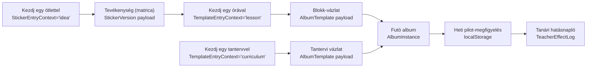

Teacher-facing labels and saved artifacts intentionally diverge from implementation names:

| Teacher-facing flow | Current implementation path | Persistence stance |
| --- | --- | --- |
| `Tevékenység (matrica)` | `CreateStickerPayload` -> `StickerResource` / `StickerVersion` | Existing sticker API. Optional activity metadata is serialized into teacher-facing note fields. |
| `Blokk-vázlat` | `CreateAlbumTemplatePayload` with `DurationType = ora` | Existing album-template API. Lesson activities become current unit rows and final-product notes. |
| `Tantervi vázlat` | `CreateAlbumTemplatePayload` with module/topic preview | Existing album-template API. Module/topic outline becomes current unit rows and final-product notes. |
| `Tanulási egység` context | Editable frontend planning metadata | No entity yet. It is displayed between `Témakör` and `Blokk` so the locked hierarchy is visible before schema work. |
| Weekly pilot observation | `localStorage` per `AlbumInstance` + unit | Not durable until the teacher merges it into the persisted closure `TeacherEffectLog`. |

The compatibility rule is: labels may help teachers think in the future hierarchy, but runtime safety stays with the existing sticker/template/instance model until a dedicated schema slice introduces `Curriculum`, `Module`, `Topic`, `LearningUnit`, or `Block`.

## Entity Relationship Diagram

```mermaid
erDiagram
    STICKER_RESOURCE ||--o{ STICKER_VERSION : versions
    STICKER_VERSION ||--o{ STICKER_VERSION_TEACHER_STEP : steps
    ALBUM_TEMPLATE ||--o{ ALBUM_TEMPLATE_VERSION : versions
    ALBUM_TEMPLATE_VERSION ||--o{ ALBUM_TEMPLATE_VERSION_DISPOSITION : dispositions
    ALBUM_TEMPLATE_VERSION ||--o{ ALBUM_TEMPLATE_VERSION_WEEK_PLAN : units
    ALBUM_TEMPLATE_VERSION ||--o{ ALBUM_TEMPLATE_VERSION_DIFFERENTIATION_PATH : differentiation_paths
    ALBUM_TEMPLATE_VERSION ||--o{ ALBUM_TEMPLATE_VERSION_STICKER : assigns
    STICKER_VERSION ||--o{ ALBUM_TEMPLATE_VERSION_STICKER : referenced_by
    ALBUM_TEMPLATE ||--o{ ALBUM_INSTANCE : instantiated_as
    ALBUM_TEMPLATE_VERSION ||--o{ ALBUM_INSTANCE : minted_from
    ALBUM_INSTANCE ||--o{ INSTANCE_STICKER : runtime_copy
    ALBUM_TEMPLATE_VERSION_STICKER ||--o{ INSTANCE_STICKER : source_assignment
    STICKER_VERSION ||--o{ INSTANCE_STICKER : frozen_version
    ALBUM_INSTANCE ||--o{ TEAM : has
    ALBUM_INSTANCE ||--o{ ALBUM_INSTANCE_WEEK_PLAN : unit_overrides
    ALBUM_INSTANCE ||--o{ ALBUM_INSTANCE_CLOSURE_CHECKLIST_ITEM : closure_checklist
    TEAM ||--o{ TEAM_MEMBER : has
    INSTANCE_STICKER ||--o{ EVIDENCE : collects
    TEAM ||--o{ EVIDENCE : submits
    INSTANCE_STICKER ||--o{ INSTANCE_STICKER_TEAM_PROGRESS : per_team_state
    TEAM ||--o{ INSTANCE_STICKER_TEAM_PROGRESS : per_team_state
    INSTANCE_STICKER ||--o{ INSTANCE_STICKER_TEAM_DIFFERENTIATION_PATH : per_team_path
    TEAM ||--o{ INSTANCE_STICKER_TEAM_DIFFERENTIATION_PATH : per_team_path
    ALBUM_INSTANCE ||--o{ TEAM_HELP_REQUEST : help_requests
    TEAM ||--o{ TEAM_HELP_REQUEST : raises
    ALBUM_INSTANCE ||--o{ ALBUM_INSTANCE_TEAM_REFLECTION : team_reflections
    TEAM ||--o{ ALBUM_INSTANCE_TEAM_REFLECTION : writes
    AI_ADVICE_RUN ||--o{ AI_ADVICE : creates

    STICKER_RESOURCE {
        uuid Id PK
        string Title
        datetime ArchivedAt
        datetime CreatedAt
        datetime UpdatedAt
    }

    STICKER_VERSION {
        uuid Id PK
        uuid StickerResourceId FK
        int VersionNumber
        string Title
        string Phase
        text StudentInstruction
        text BPlan
        text LowResource
        datetime CreatedAt
    }

    ALBUM_TEMPLATE {
        uuid Id PK
        string Title
        string Subject
        string Grade
        string DurationType "het, ora, or fazis"
        string PatternKey "altalanos, produktiv-hibazas, or kutatas-bizonyitas"
        string PatternName
        string PatternDescription
        string DrivingQuestion
        datetime ArchivedAt
    }

    ALBUM_TEMPLATE_VERSION {
        uuid Id PK
        uuid AlbumTemplateId FK
        int VersionNumber
        bool IsDraft "partial unique index: at most one draft per template"
        string Title
        string Subject
        string Grade
        string DurationType
        string PatternKey
        string PatternName
        string PatternDescription
        string DrivingQuestion
        string FinalProduct
        string Audience
        datetime CreatedAt
    }

    ALBUM_TEMPLATE_VERSION_WEEK_PLAN {
        uuid Id PK
        uuid AlbumTemplateVersionId FK
        int WeekNumber "unit index; labeled by DurationType"
        string Title
    }

    ALBUM_TEMPLATE_VERSION_DIFFERENTIATION_PATH {
        uuid Id PK
        uuid AlbumTemplateVersionId FK
        string Phase
        string PathKey "tamogatott, alap, or kihivas"
        string Title
        text Description
        text RecommendedFor
        int SortOrder
    }

    ALBUM_TEMPLATE_VERSION_STICKER {
        uuid Id PK
        uuid AlbumTemplateVersionId FK
        uuid StickerVersionId FK
        int Week "unit index"
        int SortOrder
    }

    ALBUM_INSTANCE {
        uuid Id PK
        uuid AlbumTemplateId FK
        uuid AlbumTemplateVersionId FK
        string Title
        string ClassName
        int CurrentWeek "current unit index"
        datetime ArchivedAt
    }

    ALBUM_INSTANCE_WEEK_PLAN {
        uuid Id PK
        uuid AlbumInstanceId FK
        int WeekNumber "unit index"
        string Title
    }

    ALBUM_INSTANCE_CLOSURE_CHECKLIST_ITEM {
        uuid Id PK
        uuid AlbumInstanceId FK
        int SortOrder
        string Label
        bool Done
    }

    INSTANCE_STICKER {
        uuid Id PK
        uuid AlbumInstanceId FK
        uuid AlbumTemplateStickerId FK
        uuid AlbumTemplateVersionStickerId FK
        uuid StickerVersionId FK
        int Week
        int SortOrder
        string State "tervezett or aktiv (lifecycle)"
        bool Deprecated "kept after template upgrade removed it"
    }

    INSTANCE_STICKER_TEAM_PROGRESS {
        uuid Id PK
        uuid InstanceStickerId FK
        uuid TeamId FK
        string State "varakozik, javitas, elkeszult, reflektalt"
        uuid LatestEvidenceId
        datetime UpdatedAt
    }

    INSTANCE_STICKER_TEAM_DIFFERENTIATION_PATH {
        uuid Id PK
        uuid InstanceStickerId FK
        uuid TeamId FK
        string PathKey "tamogatott, alap, or kihivas"
        datetime AssignedAt
    }

    EVIDENCE {
        uuid Id PK
        uuid InstanceStickerId FK
        uuid TeamId FK
        string Type
        string Status
        string Title
        text Description
        text HelpRequest
        bool HelpRequested
        text Reflection
        text TeacherFeedback
        datetime SubmittedAt
        datetime FeedbackAt
        datetime SeenByTeamAt "first time the student-side rendered the feedback"
    }

    TEAM_HELP_REQUEST {
        uuid Id PK
        uuid AlbumInstanceId FK
        uuid TeamId FK
        uuid InstanceStickerId
        text Question
        datetime CreatedAt
        datetime ResolvedAt "null = still open"
    }

    ALBUM_INSTANCE_TEAM_REFLECTION {
        uuid Id PK
        uuid AlbumInstanceId FK
        uuid TeamId FK
        text Text
        datetime UpdatedAt
    }

    QUALITY_DIMENSION {
        uuid Id PK
        string OwnerType
        uuid OwnerId
        string Code
        int Score
        string State
    }

    AI_NOTE {
        uuid Id PK
        string OwnerType
        uuid OwnerId
        string TargetType
        uuid TargetId
        string TargetKey
        string Kind
        string Severity
    }

    AI_ADVICE_RUN {
        uuid Id PK
        string Audience
        string OwnerType
        uuid OwnerId
        string TargetType
        uuid TargetId
        string SnapshotHash
        string Status
        string PromptVersion
        string ProjectionVersion
    }

    AI_ADVICE {
        uuid Id PK
        uuid RunId FK
        string Audience
        string OwnerType
        uuid OwnerId
        string TargetType
        uuid TargetId
        string TargetKey
        string Kind
        string Severity
        string Status
        jsonb QuestionsJson
        jsonb CitationsJson
        string ActionType
        jsonb ActionPayloadJson
    }
```

## Per-Team Submission State Machine

`InstanceStickerTeamProgress.State` tracks where each team stands on each instance sticker. The
API owns all transitions; the frontend reads the state, never writes it.

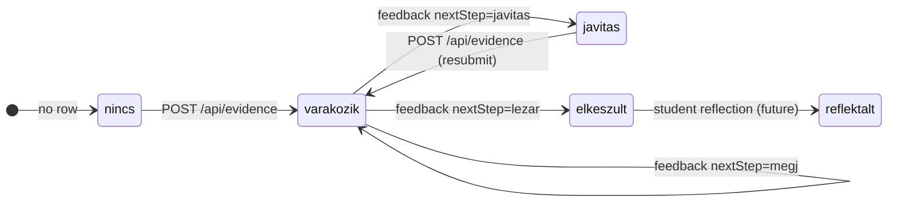

Banner mapping in Diák nézet:

| Progress state | Student banner |
| --- | --- |
| *(no row)* | "Töltsétek fel a bizonyítékot..." |
| `varakozik` | "Beküldtétek, a tanár áttekinti..." |
| `javitas` | "A tanári visszajelzés alapján..." |
| `elkeszult` / `reflektalt` | "Lezárt matrica..." |

The teacher's album-plan view aggregates these per sticker into counts ("3/4 beküldte", "N/N kész", "X/N javít") rendered on each `ma-sticker-card` via the `[showProgressAggregate]` input.

## Versioning And Ownership Rules

- Sticker resources are global. Content changes create a new `StickerVersion`. Soft-delete via `StickerResource.ArchivedAt`.
- Album templates are versioned: `AlbumTemplateVersion` rows own metadata, dispositions, units, differentiation paths, and sticker assignments. The parent `AlbumTemplate` keeps denormalized fields only as a synthetic fallback for the rare "no versions yet" path. Soft-delete via `AlbumTemplate.ArchivedAt`.
- Pattern metadata is copied to both `AlbumTemplate` and `AlbumTemplateVersion`. The version row is the runtime source of truth; the parent keeps denormalized fallback fields for list views and compatibility.
- `AlbumTemplatePatterns.Normalize` accepts only `altalanos`, `produktiv-hibazas`, or `kutatas-bizonyitas`; unknown or missing values fall back to `altalanos`.
- A new template created from the pattern picker gets starter content immediately on draft `v1`: units, reflection prompts, and starter sticker assignments. Changing only `PatternKey` later is metadata-only and does not destroy or regenerate teacher edits.
- A template can have at most one draft version at a time (enforced by a partial unique index). Drafts auto-create on first edit of a published template; brand-new templates start life as a `v1` draft. Edits hit `PATCH /album-template-versions/{vid}` (metadata) and the per-sticker endpoints; Publikálás flips `IsDraft = false`.
- `DurationType` (`het | ora | fazis`) labels what each unit row in `album_template_version_week_plans` represents. The number of units is implicit from the row count.
- Differentiation paths live on `AlbumTemplateVersion` as one support/base/challenge path per phase. Old versions without rows hydrate default paths at API mapping time.
- Fresh draft-only templates are visible in the albumterv list/detail through the draft fallback path, but remain excluded from instance creation until published.
- `AlbumInstance.AlbumTemplateVersionId` binds the running instance to the exact template version it was minted from, so later template edits don't disturb it. `AlbumInstance.AlbumTemplateId` is kept alongside for join convenience and backward compatibility.
- Album instances copy template-version sticker assignments into `InstanceSticker` rows. Runtime lifecycle state lives only there; per-team submission state lives on `InstanceStickerTeamProgress`.
- Per-team differentiation choices live on `InstanceStickerTeamDifferentiationPath`, scoped to the running sticker and team. These rows are teacher adaptation history, not assessment or ranking.
- `InstanceSticker.State` is **lifecycle-only** (`tervezett | aktiv`). Teacher controls when a sticker opens; once opened it stays `aktiv` regardless of how many teams have submitted.
- `InstanceStickerTeamProgress` is the single source of truth for "where is team X on sticker Y." Missing rows are implicitly "not started." The teacher feedback flow may upsert rows; the student evidence submit flow always upserts.
- Teams and evidence belong to an album instance, never to a template.
- `Evidence.HelpRequested` is a structured student-side help signal. The teacher feedback queue surfaces it as a chip and filter. Saving teacher feedback clears the flag (`HelpRequested = false`).
- `QualityDimension` and `AiNote` use `OwnerType` + `OwnerId` so checks can belong to sticker versions, templates, or instances.
- `AiAdvice` is lifecycle-bearing advice: it can be new, accepted, rejected, applied, or failed. Action payloads are drafts until a teacher applies them.
- The AI agent receives only a sanitized snapshot from the .NET API. It cannot read the app database and cannot write `agent-wiki`.
- The API passes `AiAdviceRun.Id` to the agent as `traceId`; the agent emits JSON `advice_trace` log events with the same `runId` for wiki search, LLM calls, fallback, and response validation.
- `agent-wiki` projection version `matricas-methodology-agent-wiki-v1` is a self-contained markdown knowledge base generated from the methodology source-book. It includes teacher-facing methodology pages, student Socratic-question guardrails, citation display labels, optional checksum metadata, and runtime usage rules for how the AI agent should ground advice in the projection.
- Existing local database volumes from the old schema must be reset with `docker compose down -v`; startup does not destructively delete data.

## Agent-Wiki Projection

The committed `agent-wiki/` directory is runtime knowledge for the AI agent, not a documentation export. It contains the source-book projection: methodology pages for album design, sticker anatomy, evidence/portfolio guidance, feedback/revision, teacher facilitation, student Socratic-question guardrails, and an explicit `agent-wiki-hasznalati-szabalyok.md` page that defines how the agent must use the wiki.

Projection maintenance:

- Do **not** use the old `tools/refresh-agent-wiki.ps1` path for the current projection.
- Canonical source is `agent-wiki/source-book/matricas-album-modszertani-kezikonyv.md`.
- Regeneration follows `agent-wiki/source-book/agent-wiki-projection-prompt.md`.
- Generated pages use local markdown links only; the agent has no runtime dependency on the main discovery wiki.
- The manifest is a runtime contract: projection version, page kind, display label, and hidden/visible citation behavior. Checksum fields may remain as projection metadata, but runtime startup does not fail on checksum drift.

## Public API

| Method | Route | Purpose |
| --- | --- | --- |
| `GET` | `/api/stickers` | List global sticker resources with latest version metadata. |
| `POST` | `/api/stickers` | Create a sticker resource with version 1. |
| `GET` | `/api/stickers/{id}` | Sticker resource detail and versions. |
| `POST` | `/api/stickers/{id}/versions` | Create a new version of a sticker resource. |
| `PATCH` | `/api/stickers/{id}/archive` | Toggle `StickerResource.ArchivedAt` (soft delete; archived stickers stay readable but are hidden from default pickers). |
| `GET` | `/api/album-templates` | List reusable album templates. Carries `isDraftOnly` plus pattern metadata so the list can show and filter by album-minta. |
| `POST` | `/api/album-templates` | Create an album template. `v1` lands with `IsDraft = true`; the teacher publishes from the detail page. Body carries `durationType: 'het' \| 'ora' \| 'fazis'`, `patternKey`, optional pattern label/description, units, and prompts; the server adds starter sticker assignments from the selected album-minta. |
| `GET` | `/api/album-templates/{id}` | Album template detail with pattern metadata, assigned sticker versions + the full version list (drafts included). |
| `PATCH` | `/api/album-templates/{id}/archive` | Toggle `AlbumTemplate.ArchivedAt`. |
| `DELETE` | `/api/album-templates/{id}` | Hard-delete fresh draft-only templates (no instances, sole version is a draft); 409 otherwise. |
| `POST` | `/api/album-templates/{id}/versions` | Create a new published version directly (legacy); 409 if a draft already exists. |
| `POST` | `/api/album-templates/{id}/draft` | Idempotent: ensures a draft exists by cloning the latest published version. |
| `POST` | `/api/album-templates/{id}/draft/publish` | Flip `IsDraft = false` on the draft → it becomes the new latest version. |
| `DELETE` | `/api/album-templates/{id}/draft` | Discard the draft. |
| `PATCH` | `/api/album-template-versions/{versionId}` | Update draft metadata (title, subject, grade, durationType, pattern metadata, dispositions, week titles, …). Debounced 400ms client-side. |
| `POST` | `/api/album-template-versions/{versionId}/stickers` | Add a sticker to the draft. |
| `PATCH` | `/api/album-template-versions/{versionId}/stickers/{stickerId}` | Patch a single draft sticker's week/sortOrder. |
| `POST` | `/api/album-template-versions/{versionId}/stickers/reorder` | Bulk reorder/move in one transaction. Two-pass write so the unique `(versionId, Week, SortOrder)` index doesn't collide mid-swap. Used by drag-drop and arrow-button swaps. |
| `DELETE` | `/api/album-template-versions/{versionId}/stickers/{stickerId}` | Remove a sticker from the draft. |
| `POST` | `/api/album-templates/{id}/stickers` | Legacy assignment endpoint — writes to the latest published version's sticker list. |
| `POST` | `/api/album-templates/{id}/instances` | Instantiate a template for a class/team setup. The instance is bound to the current published version via `AlbumTemplateVersionId`. |
| `GET` | `/api/album-instances` | List running album instances. Carries `durationType` + `unitCount`. |
| `GET` | `/api/album-instances/{id}` | Instance detail graph for teacher/student UI. |
| `PATCH` | `/api/album-instances/{id}` | Edit instance title, className, and current unit. Template-derived subject/grade/durationType stay readonly. |
| `PATCH` | `/api/album-instances/{id}/archive` | Toggle `AlbumInstance.ArchivedAt`; archived instances are hidden from default lists but remain readable. |
| `GET` | `/api/album-instances/{id}/upgrade-preview` | Compare the bound template version with the latest published version and show added/repointed/removed/unit-change effects. |
| `POST` | `/api/album-instances/{id}/upgrade` | Atomically opt a running instance into the latest published template version while preserving evidence. |
| `PUT` | `/api/album-instances/{id}/units` | Upsert per-instance unit-title overrides. |
| `PUT` | `/api/album-instances/{instanceId}/differentiation-paths` | Replace the bound template version's differentiation path texts for the running album. |
| `PATCH` | `/api/album-instances/{instanceId}/closure-checklist/{itemId}` | Toggle a closure checklist item. |
| `PATCH` | `/api/instance-stickers/{id}/state` | Update lifecycle state (`tervezett` ↔ `aktiv`). |
| `PUT` | `/api/instance-stickers/{stickerId}/teams/{teamId}/differentiation-path` | Assign or clear a team's support/base/challenge path for one runtime sticker. |
| `POST` | `/api/evidence` | Submit evidence; upserts per-team progress. Body carries `helpRequested: bool`. Returns `{ evidence, progress }`. |
| `POST` | `/api/evidence/{id}/feedback` | Save teacher feedback; updates the team progress state and clears `HelpRequested`. Returns `{ evidence, progress }`. |
| `POST` | `/api/evidence/{id}/seen` | Mark `SeenByTeamAt` so the student-side stops flagging the feedback as new. |
| `POST` | `/api/team-help-requests` | Create a free-form help request from a team (optionally scoped to an instance sticker). |
| `PATCH` | `/api/team-help-requests/{id}/resolve` | Mark a help request resolved (`ResolvedAt`). |
| `PUT` | `/api/album-instances/{id}/teams/{teamId}/reflection` | Upsert the team-level closure reflection text. |
| `POST` | `/api/ai-advice/generate` | Build sanitized state snapshot, call the AI agent, persist returned advice. Target-aware: teacher advice, student advice, `pendingEvidenceDigest`, `helpRequest`, create-sticker, draft-feedback, or `closureSynthesis`. |
| `GET` | `/api/ai-advice?ownerType=&ownerId=&audience=` | List persisted advice for an owner/audience. |
| `PATCH` | `/api/ai-advice/{id}/status` | Mark advice as accepted, rejected, applied, or failed. |
| `POST` | `/api/ai-advice/{id}/apply` | Apply an actionable advice draft, currently create-sticker or draft-feedback. |
| `DELETE` | `/api/demo-maintenance/ai-advice` | Remove generated AI advice and advice-run audit records only. |
| `POST` | `/api/demo-maintenance/reset` | Delete demo domain data and reseed the starting album plus the published album-minta templates. |

## Sequence Diagrams

### Initial Frontend Load

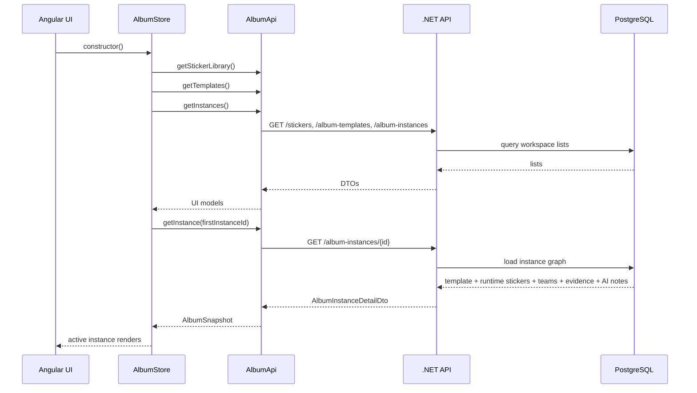

### Template Creation With Draft Editing

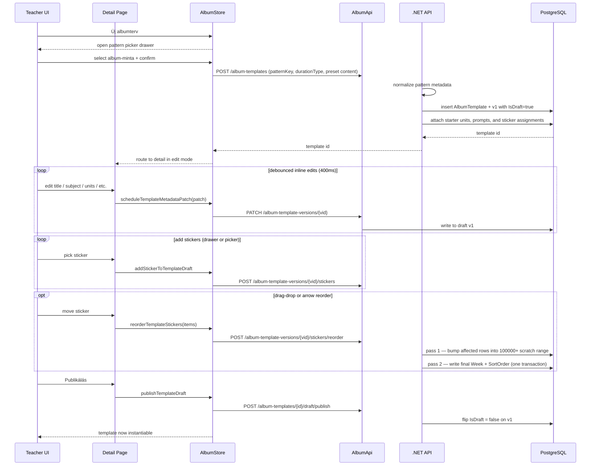

### Instance Creation

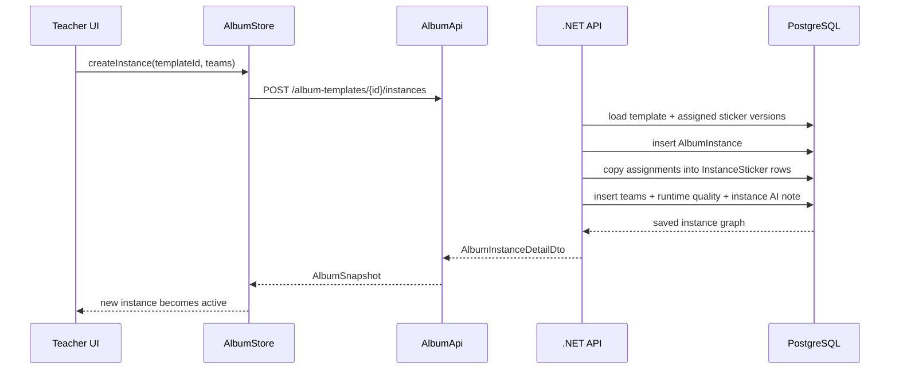

### Evidence And Feedback

```mermaid
sequenceDiagram
    participant Student as Student UI
    participant Teacher as Teacher UI
    participant Api as .NET API
    participant Db as PostgreSQL

    Student->>Api: POST /api/evidence (instanceStickerId, teamId, helpRequested)
    Api->>Db: validate team belongs to same instance
    Api->>Db: insert Evidence (status=varakozik, HelpRequested)
    Api->>Db: upsert InstanceStickerTeamProgress (state=varakozik)
    Note over Api: InstanceSticker.State is lifecycle-only; not touched
    Api-->>Student: { evidence, progress }
    Note over Student: Other teams' banners unchanged

    Teacher->>Api: POST /api/evidence/{id}/feedback (status=javitas|elkeszult)
    Api->>Db: save TeacherFeedback, clear HelpRequested
    Api->>Db: upsert InstanceStickerTeamProgress (javitas | elkeszult)
    Api-->>Teacher: { evidence, progress }
```

### Teacher Advice Generation

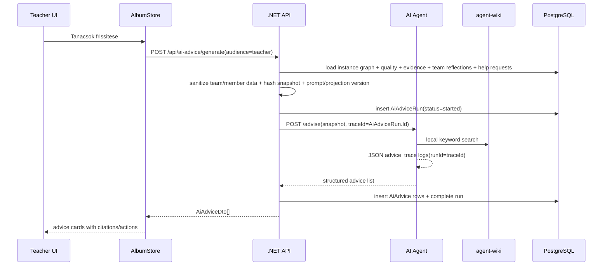

### Pending Evidence Digest

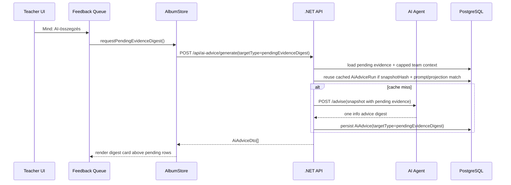

### Help-Request Triage

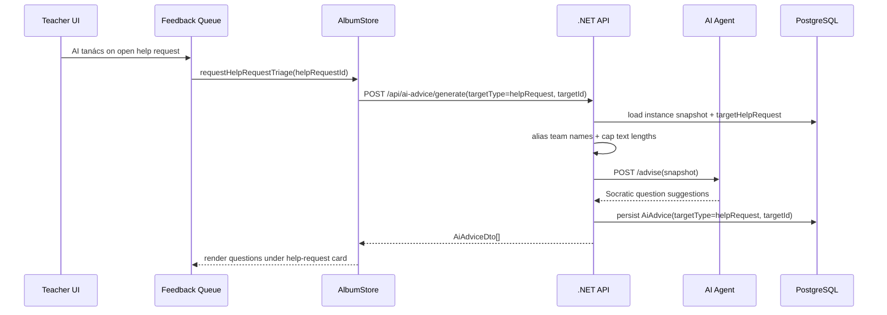

### Apply Create-Sticker Advice

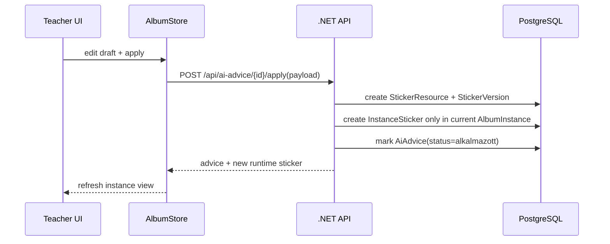

### Student Socratic Advice

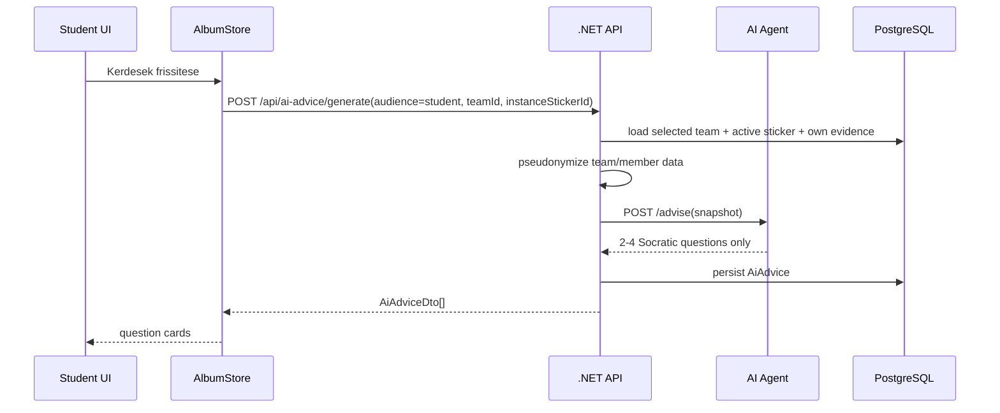

## Frontend Architecture

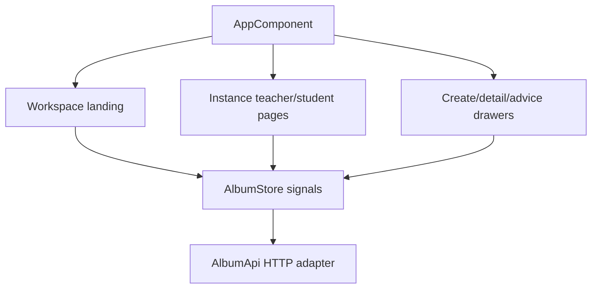

Important frontend rules:

- Landing prioritizes progressive starts: `Kezdj egy ötlettel`, `Kezdj egy órával`, and `Kezdj egy tantervvel`. `Matricatár`, `Albumtervek`, and `Futó albumok` remain secondary management/retrieval surfaces under `Kezelés és visszakeresés`.
- Create drawer labels are context-aware. Sticker creation is introduced as `Tevékenység (matrica)`, lesson entry saves a `Blokk-vázlat`, and curriculum entry saves a `Tantervi vázlat`; all still call the existing sticker/template store methods.
- Activity planning metadata includes subject, grade, competencies, NAT links, fixed activity type, interaction mode, participant mode, estimated minutes, real-world context, and optional placement context (`Tanterv`, `Modul`, `Témakör`, `Tanulási egység`, `Blokk`). These are currently frontend fields serialized into existing teacher-facing notes, not queryable schema columns.
- The lesson builder includes a placement ladder `Blokk -> Tanulási egység -> Témakör -> Modul -> Tanterv`, 3-5 editable activities, minutes, participation status, resources, reflection prompt, and alternative path. It saves through the existing album-template surface.
- The curriculum starter shows an editable module/topic preview plus one concrete expansion through `Tanulási egység`, `Blokk`, and `Tevékenység`; it does not create hierarchy entities.
- The old album pattern picker is framed as a secondary `Pedagógiai minta` so it does not compete with the product hierarchy.
- Teacher/student operational screens render the active `AlbumInstance`.
- Sticker cards in instance views use `InstanceSticker.id`, not global sticker IDs.
- Albumtervek list shows the pattern chip and supports a lightweight pattern filter (`Összes`, `Általános`, `Produktív hibázás`, `Kutatás-bizonyítás`).
- New template creation starts with a lightweight album-minta picker drawer. After the teacher chooses a pattern, `POST /album-templates` creates a draft `v1`, seeds the pattern-specific starter structure, and routes to the template detail page in edit mode. The old full drawer-based template editor remains retired; editing happens on the page.
- Template detail edit mode is inline (no drawer): clicking `Szerkesztés` flips metadata fields into inputs and per-keystroke edits are debounced (400ms) into a `PATCH /album-template-versions/{vid}` write. The legacy `POST /album-templates/{id}/versions` flow stays available but returns 409 if a draft already exists.
- Template detail edit mode includes the album-minta select. This updates pattern metadata only; the current draft's units and stickers stay under teacher control.
- Template plan section unifies week-titles and sticker assignment into per-unit containers; the section header label adapts to `durationType`. Sticker movement is via Angular CDK drag-drop + up/down/left/right arrow buttons, all routed through the bulk `stickers/reorder` endpoint so the unique index on `(versionId, Week, SortOrder)` doesn't collide mid-swap.
- The `Új albumterv` Mégse path hard-deletes the draft template (`DELETE /album-templates/{id}`); editing an existing template uses Elvetés (which only removes the draft, leaving the published version intact).
- Teacher advice cards are persisted `AiAdvice` records and can open an edit-before-apply drawer.
- The feedback queue has a target-specific AI digest (`targetType='pendingEvidenceDigest'`) rendered above pending evidence. It is cached by snapshot hash + prompt version + projection version.
- Help-request cards can request target-specific triage (`targetType='helpRequest'`, `targetId=<TeamHelpRequest.Id>`). Returned Socratic questions render inline under the request and retain the normal advice lifecycle.
- Closure has a target-specific synthesis card (`targetType='closureSynthesis'`) that surfaces patterns and teacher reflection questions from the whole running album snapshot. It intentionally does not score the class, rank teams, or decide next pedagogy.
- Closure also checks for local weekly pilot observations for the active instance and offers a `Beemelés` action that merges them into the persisted teacher effect-log fields. This bridge is intentionally teacher-reviewed; no local note is automatically persisted as evaluation.
- The Differenciálás page reads version-backed paths and running-sticker team assignments. It supports inline path text edits, per-team assignment/clearing, and a history view of which team took which path.
- Student advice cards render only Socratic questions for the active team/sticker context, and clear automatically when the selected team changes (user must re-click "Kérdések frissítése").
- Feedback draft advice pre-fills the feedback drawer; it never saves teacher feedback automatically.
- **Diák nézet team scope**: `AlbumStore.studentTeamId` selects which team's view is rendered. A pill-style team picker above the album poster lets the teacher switch when previewing. `currentStickerForStudent`, the banner, and "Megszerzett matricák" derive from the selected team's `InstanceStickerTeamProgress` rows. `progressFor(stickerId, teamId)` is the canonical lookup.
- **Role-aware drawers**: the singleton `ma-feedback-drawer` receives `[mode]="store.role() === 'student' ? 'student' : 'teacher'"`. Student mode hides the AI summary, rubric reminder, feedback textarea, and next-step choices, and renders the teacher's saved feedback read-only. The `ma-sticker-detail-drawer` similarly hides teacher-only sections (`TeacherSteps`, `BPlan`, `LowResource`, AI and Differenciálás tabs) when `store.role() === 'student'`, and adds a "Csapatunk állapota" card.
- **Help signal**: the student evidence form has a "Segítséget kérek a tanártól" checkbox that maps to `Evidence.HelpRequested`. The teacher feedback queue shows a danger chip and orange border for flagged rows, plus a "Csak segítségkérések" filter toggle. Saving feedback clears the flag.
- **Team history**: a "Csapatunk eddigi munkája" panel lists the selected team's prior submissions with non-empty `teacherFeedback`. Clicking a row opens the read-only student-mode feedback drawer.

## Architecture Maintenance Rules

- Update this Markdown whenever the domain, API routes, data flow, deployment, or diagram-relevant UI structure changes.
- Keep `architecture.html` aligned with this source whenever the HTML snapshot is intentionally refreshed.
- Keep the docs folder limited to architecture, user manual, and the docs README. Put historical planning notes in `LOG.md`, `roadmap.md`, or `backlog.md` instead of adding new one-off files here.
