# Matricás Album - vizuális felhasználói kézikönyv

Ez a kézikönyv tanároknak és belső bemutatóknak készült. Nem funkciólistaként érdemes olvasni, hanem térképként: mit jelent az album, hol történik a tanári döntés, hol dolgozik a csapat, és hol segít az AI.

> Alapelv: a Matricás Album nem jutalomrendszer. Az album a tanulási út, a `tevékenység (matrica)` pedig egy bizonyítékot termelő tanulási epizód. A tanár indulhat egy ötletből, egy órából vagy egy tantervi vázból; a teljes hierarchiát nem kell előre kitölteni.

---

## 0. Koncepciókapcsolati térkép

Az alábbi hivatkozások azt mutatják, hogy a kézikönyvben leírt funkciók melyik Confluence-vízió vagy Lauder-visszajelzés termékbe fordításai.

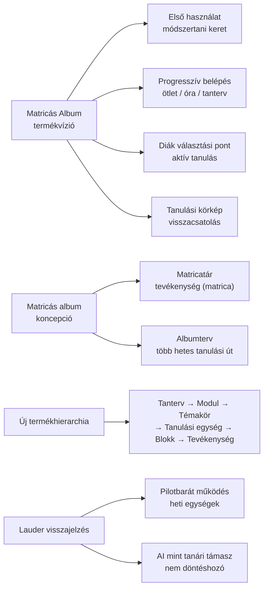

| Funkció a kézikönyvben | Megvalósított koncepció | Confluence forrás |
|---|---|---|
| Progresszív belépési utak | A tanár kezdhet egy ötlettel, egy órával/blokkal vagy egy tantervi vázzal, teljes hierarchia-kényszer nélkül | [Matricás Album termékvízió](https://gdemikk.atlassian.net/wiki/spaces/AI/pages/722370562/Matric+s+Album+-+Term+kv+zi) |
| Első használati módszertani keret | Egy új tanár számára intuitívan érthetővé kell tenni, hogy mi az album és a tevékenység (matrica) | [Lauder bemutatás](https://gdemikk.atlassian.net/wiki/spaces/DPA/pages/709296137/2026-05-20+Lauder+-+Lecke+bemutat+sa), [Matricás Album termékvízió](https://gdemikk.atlassian.net/wiki/spaces/AI/pages/722370562/Matric+s+Album+-+Term+kv+zi) |
| Matricatár | A tevékenység (matrica) tanulási mini-forgatókönyv, nem puszta feladat | [Matricás album koncepció](https://gdemikk.atlassian.net/wiki/spaces/AI/pages/631963649/Matric+s+album), [Lauder bemutatás](https://gdemikk.atlassian.net/wiki/spaces/DPA/pages/709296137/2026-05-20+Lauder+-+Lecke+bemutat+sa) |
| Tanulási egység és blokk | A tantervi hierarchia láthatóvá válik, de egyelőre szerkeszthető tervezési metaadatként | [Matricás Album termékvízió](https://gdemikk.atlassian.net/wiki/spaces/AI/pages/722370562/Matric+s+Album+-+Term+kv+zi) |
| Albumterv és futó album | Több órán vagy héten átívelő tanulási ív, heti egységekkel és reflektív lezárással | [Matricás album koncepció](https://gdemikk.atlassian.net/wiki/spaces/AI/pages/631963649/Matric+s+album), [Több órán átívelő tanulási sorozatok](https://gdemikk.atlassian.net/wiki/spaces/AI/pages/644251658) |
| Diákoldali választási pont | A diák aktív szereplő, dönthet és alakíthatja saját tanulási folyamatát | [Matricás Album termékvízió](https://gdemikk.atlassian.net/wiki/spaces/AI/pages/722370562/Matric+s+Album+-+Term+kv+zi) |
| Bizonyíték és tanári feedback | A tanulási epizódnak látható outputja, evidence-e, értelmezése és visszajelzési pontja van | [Matricás album koncepció](https://gdemikk.atlassian.net/wiki/spaces/AI/pages/631963649/Matric+s+album), [Matricás Album termékvízió](https://gdemikk.atlassian.net/wiki/spaces/AI/pages/722370562/Matric+s+Album+-+Term+kv+zi) |
| Differenciálási nézet | Adaptív pedagógiai mozgástér és helyi igényekhez igazítás | [Matricás Album termékvízió](https://gdemikk.atlassian.net/wiki/spaces/AI/pages/722370562/Matric+s+Album+-+Term+kv+zi), [Lauder bemutatás](https://gdemikk.atlassian.net/wiki/spaces/DPA/pages/709296137/2026-05-20+Lauder+-+Lecke+bemutat+sa) |
| AI draftok és tanácsok | Az AI ötletet, kérdést és draftot ad, de nem veszi át a pedagógiai döntést | [Matricás Album termékvízió](https://gdemikk.atlassian.net/wiki/spaces/AI/pages/722370562/Matric+s+Album+-+Term+kv+zi), [Lauder AI-visszajelzés](https://gdemikk.atlassian.net/wiki/spaces/DPA/pages/709296137/2026-05-20+Lauder+-+Lecke+bemutat+sa) |
| Projektzárás, tanulási körkép és hatásnapló | A rendszer a tanulási folyamatokból visszacsatolást termel, hogy a következő futtatás jobb legyen | [Matricás Album termékvízió](https://gdemikk.atlassian.net/wiki/spaces/AI/pages/722370562/Matric+s+Album+-+Term+kv+zi), [Matricás album koncepció](https://gdemikk.atlassian.net/wiki/spaces/AI/pages/631963649/Matric+s+album) |

Kapcsolódó módszertani háttérok: [Pedagógiai módszertanok](https://gdemikk.atlassian.net/wiki/spaces/AI/pages/644907019), [projektoktatás](https://gdemikk.atlassian.net/wiki/spaces/AI/pages/645431311), [inquiry](https://gdemikk.atlassian.net/wiki/spaces/AI/pages/645431318), [kooperatív tanulás](https://gdemikk.atlassian.net/wiki/spaces/AI/pages/643956794), [csoportmunka](https://gdemikk.atlassian.net/wiki/spaces/AI/pages/644087861), [páros munka](https://gdemikk.atlassian.net/wiki/spaces/AI/pages/644055086), [jigsaw](https://gdemikk.atlassian.net/wiki/spaces/AI/pages/644808744), [kompetenciák](https://gdemikk.atlassian.net/wiki/spaces/AI/pages/644612117).

---

## 1. A termék egy képen

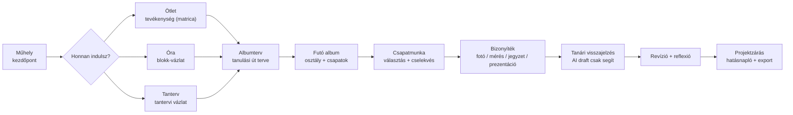

### Mit jelentenek a fő fogalmak?

| Fogalom | Képben gondolkodva | Mire való? | Nem ez |
|---|---|---|---|
| Album | Tanulási útvonal | Egy több lépésből álló pedagógiai folyamat kerete | Feladatlista |
| Tevékenység (matrica) | Tanulási epizód | Egy aktív cselekvés, amely látható bizonyítékot termel | Badge vagy pont |
| Tanulási egység | Egy téma kezelhető tanulási darabja | Több blokkot/órát fog össze | Külön adatbázis-objektum a mostani prototípusban |
| Blokk | Órai vagy rövid tanulási szervezés | 3-5 tevékenységet és időkeretet rendez össze | Teljes tanterv |
| Bizonyíték | Nyom a tanulási útról | A csapat munkájának megfigyelhető produktuma | Csak beadandó fájl |
| Visszajelzés | Tanári irányítási pont | Segít dönteni: lezárás, javítás, következő lépés | Automatikus értékelés |
| Reflexió | Tanulási lezárás | Megmutatja, mi változott a gondolkodásban | Adminisztratív utómunka |
| Hatásnapló | Tanári tanulási adat | Mit tanult a tanár ebből a futtatásból | Minősítés vagy rangsor |

---

## 2. Szerepek és nézetek

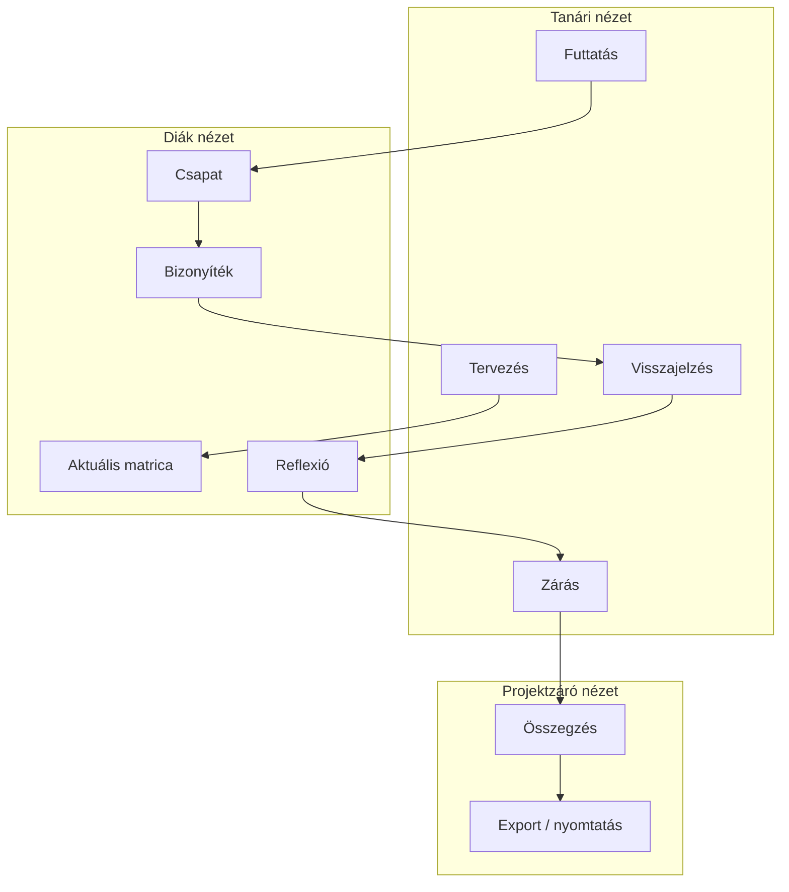

### Nézetválasztás gyorsan

| Ha ezt akarod... | Ezt a nézetet nyisd meg |
|---|---|
| Megnézni, hol tart a projekt | Tanár: **Műhely** vagy **Futó album** |
| Új tanulási epizódot készíteni | Tanár: **Kezdj egy ötlettel**, **Matricatár** vagy **Futó album / Új matrica** |
| Albumtervet szerkeszteni | Tanár: **Albumtervek** |
| Csapatokat kezelni | Tanár: **Csapatok** |
| Beadásokat áttekinteni | Tanár: **Visszajelzési sor** |
| Egy csapat szemével látni az appot | **Diák nézet** |
| Projektzáró anyagot készíteni | Tanár: **Projektzárás** |

---

## 3. Tanári oldalsáv térképe

> Koncepciókapcsolat: az oldalsáv szándékosan a tanári facilitációt követi végig a tervezéstől a visszajelzésen át a zárásig, összhangban a [Matricás Album termékvízió pedagógus-szerepváltásával](https://gdemikk.atlassian.net/wiki/spaces/AI/pages/722370562/Matric+s+Album+-+Term+kv+zi).

```text
MŰHELY
  Műhely

KEZELÉS
  Matricatár
  Albumtervek
  Futó albumok

AKTÍV FUTÓ ALBUM
  Futó album
  Futó matricák
  Csapatok
  Bizonyíték-portfólió

PEDAGÓGIA
  Visszajelzési sor
  Album minőségellenőrző
  Differenciálás
  Projektzárás

ALUL
  Pedagógiai súgó
  Beállítások
```

### Mentális térkép

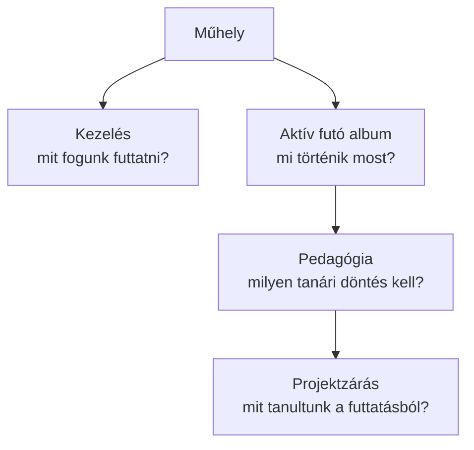

---

## 4. A tanári munkafolyamat lépésről lépésre

### 4.1 Indulás: Műhely

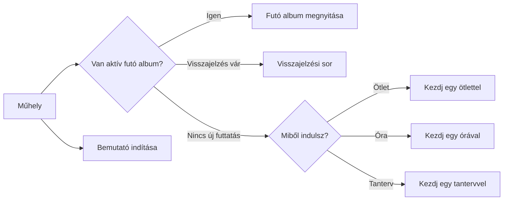

**Mit nézz itt?**

| Képernyőrész | Jelentés | Következő tanári lépés |
|---|---|---|
| Prioritási sáv | Egy javasolt “most ezt csináld” irány | Kattints a fő CTA-ra |
| Belépési utak | Három tervezési kezdőpont: ötlet, óra/blokk, tanterv | Válaszd azt, ami most a legkisebb hasznos lépés |
| Aktív futó album | A jelenlegi osztályprojekt állapota | Nyisd meg a futó albumot vagy a visszajelzési sort |
| Kezelés és visszakeresés | Matricatár, Albumtervek, Futó albumok | Akkor használd, ha meglévő anyagot keresel, újrafuttatsz vagy állapotot nézel |
| Bemutató indítása | Vezetett mikroklíma demo | Használd bemutatón vagy betanításon |

### A három belépési út

| Belépési út | Mit hoz létre? | Mikor jó? | Fontos korlát |
|---|---|---|---|
| **Kezdj egy ötlettel** | Szerkeszthető `tevékenység (matrica)` vázlatot | Van egy mérés, megfigyelés vagy tanulói kérdés | Az AI csak előtölt; mentés előtt a tanár ellenőrzi |
| **Kezdj egy órával** | `Blokk-vázlatot` 3-5 tevékenységgel és percbeosztással | Konkrét 45 perces órát akarsz összerakni | A blokk még albumtervként mentődik, nincs új blokkséma |
| **Kezdj egy tantervvel** | `Tantervi vázlatot` modulokkal és témakörökkel | Magasabb szintről tervezel, de nem akarsz teljes struktúrát kitölteni | A tantervi hierarchia most még vázlat, nem külön adatmodell |

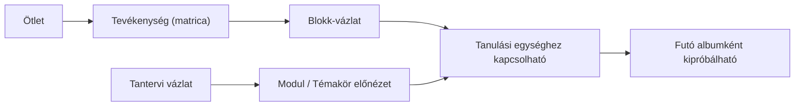

---

### 4.2 Matricatár: tevékenységek (matricák) készlete

> Koncepciókapcsolat: a Matricatár a [Matricás album koncepcióban](https://gdemikk.atlassian.net/wiki/spaces/AI/pages/631963649/Matric+s+album) leírt "matrica = strukturált tanulási tevékenység" gondolat termékbeli otthona.

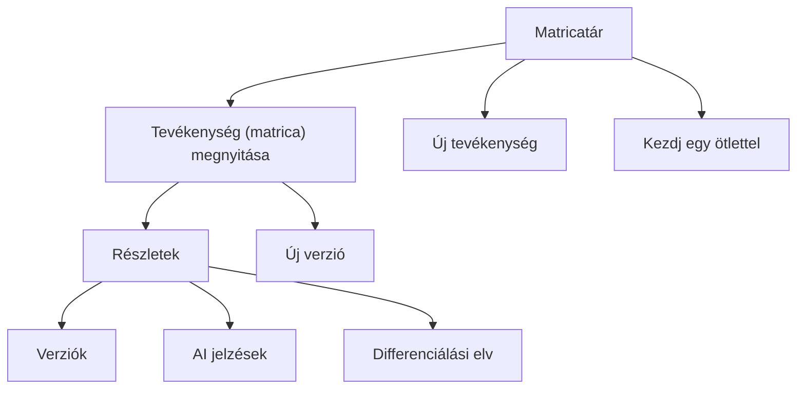

**Mikor használd?**

| Helyzet | Mit csinálj? |
|---|---|
| Újrahasználható tanulási epizód kell | Hozz létre új tevékenységet vagy indulj a **Kezdj egy ötlettel** úton |
| Egy meglévő tevékenység jó, de módosítanád | Használd az adaptálást vagy hozz létre új verziót |
| Már futó albumhoz kell egyszeri kiegészítés | Ne a Matricatárból indulj, hanem a **Futó album / Új matrica** gombból |

**Tevékenység (matrica) szerkezete**

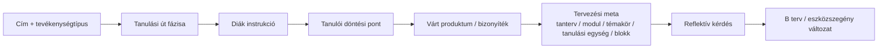

**Tevékenységtípus és fázis nem ugyanaz.**

| Mező | Jelentés | Példa |
|---|---|---|
| Tevékenységtípus | Mit csinálnak a diákok? | Felfedező, Kísérletező, Feldolgozó, Kommunikációs, Kollaboratív, Reflektív |
| Tanulási út fázisa | Hol tart a tanulási folyamat? | Kérdezés, Képzelet, Cselekvés, Reflexió |

---

### 4.3 Albumtervek: a tanulási út terve

> Koncepciókapcsolat: az Albumterv a több órán átívelő tematikus keretet fordítja működő tanári tervezőfelületté, lásd [Matricás album koncepció](https://gdemikk.atlassian.net/wiki/spaces/AI/pages/631963649/Matric+s+album) és [Több órán átívelő tanulási sorozatok](https://gdemikk.atlassian.net/wiki/spaces/AI/pages/644251658).

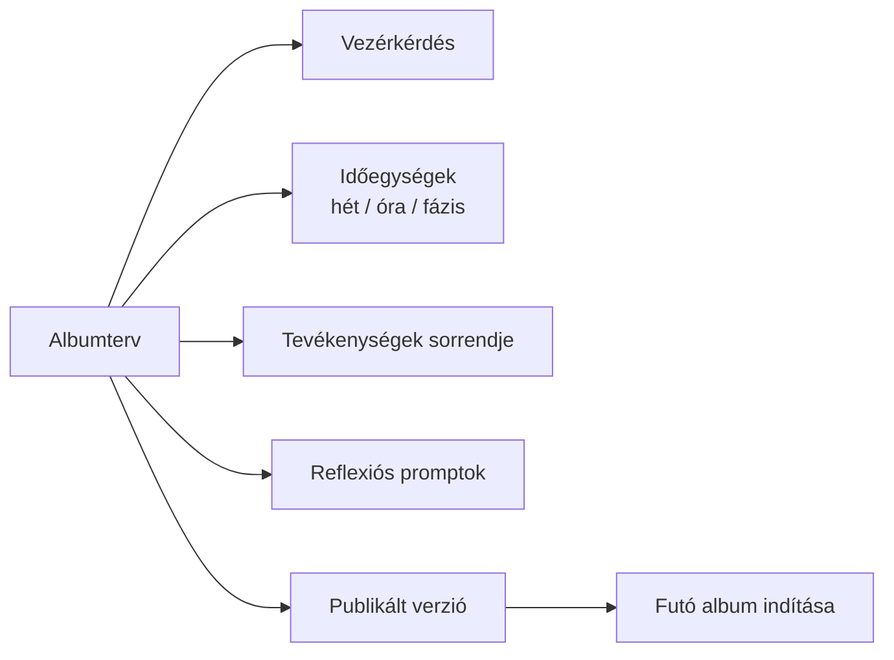

**Új albumterv készítésekor először ezt látod:**

```text
Módszertani keret
  Album   = tanulási út
  Tevékenység (matrica) = bizonyítékos epizód
  Tanár   = facilitátor
```

**Progresszív tervezési szintek**

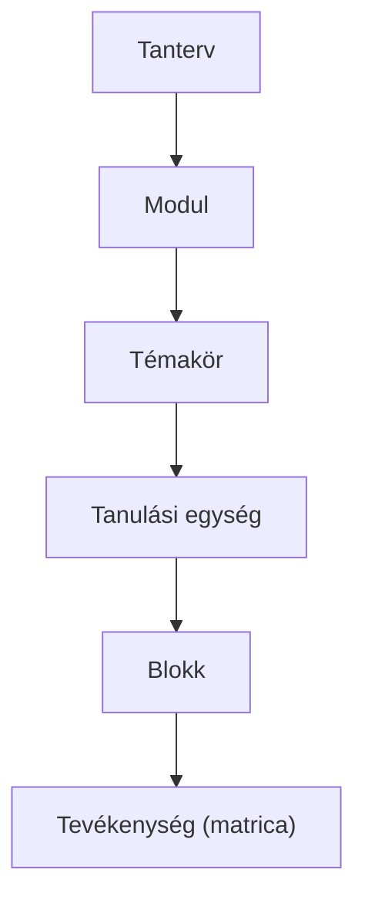

Jelenleg ezek közül a `Tevékenység`, a `Blokk-vázlat` és a `Tantervi vázlat` látszik a felületen. A `Tanulási egység` elhelyezési mezőként jelenik meg, hogy a későbbi hierarchia érthető legyen, de még nem kell külön adatmodellként kezelni.

**Döntési pontok albumtervnél**

| Döntés | Jó kérdés magadnak |
|---|---|
| Milyen vezérkérdés viszi végig az albumot? | A diákok tudnak róla saját döntést hozni? |
| Hány egységből álljon? | Hetekben, órákban vagy fázisokban gondolkodom? |
| Milyen tevékenységek kerüljenek bele? | Minden fontos ponton keletkezik látható bizonyíték? |
| Van-e órai blokk vagy tanulási egység kontextus? | A tevékenységek természetes sorrendben épülnek egymásra? |
| Milyen legyen a záró reflexió? | Kiderül belőle, hogyan változott a gondolkodás? |

---

### 4.4 Futó album: osztályhoz kötött megvalósítás

> Koncepciókapcsolat: a Futó album a Lauder-visszajelzésben megjelenő heti egység, csapatmunka és pilotbarát kipróbálhatóság operatív nézete ([Lauder bemutatás](https://gdemikk.atlassian.net/wiki/spaces/DPA/pages/709296137/2026-05-20+Lauder+-+Lecke+bemutat+sa)).

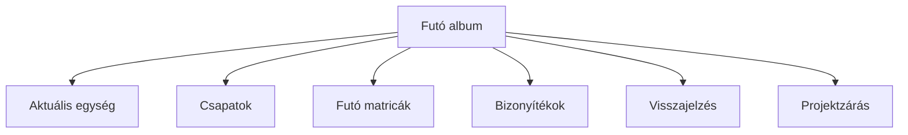

**Itt már nem csak tervet látsz, hanem valós osztálymunkát.**

| Mit kezelsz itt? | Példa |
|---|---|
| Cím, osztály, egység | `7.B mikroklíma projekt`, aktuális hét |
| Csapatok | tagok, fókusz, szín |
| Futó matricák | aktív / tervezett / lezárt epizódok |
| Bizonyítékok | beadások, segítségkérések, reflexiók |
| Tanári döntések | javításra visszaküldés, lezárás, hatásnapló |

---

## 5. Diákoldali út

> Koncepciókapcsolat: a diákoldali nézet a [termékvízió](https://gdemikk.atlassian.net/wiki/spaces/AI/pages/722370562/Matric+s+Album+-+Term+kv+zi) aktív, választási lehetőséget adó tanulóképet teszi láthatóvá.

### Diák oldalsáv térképe

```text
CSAPAT
  aktuális csapat
  választott fókusz

ALBUM
  Aktuális matrica
  Csapatunk
  Bizonyítékaink
  Visszajelzések
  Reflexió

ALUL
  Segítség
```

### Diák munkafolyamat

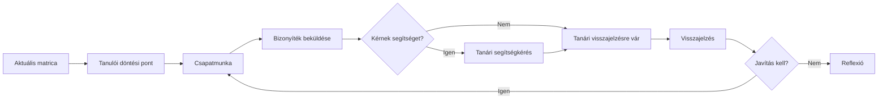

### Mit lát a diák az Aktuális matricán?

| Blokk | Mit jelent? |
|---|---|
| Fázis + állapot | Hol jár a matrica? Aktív, várakozik, javítás alatt, lezárt |
| Diák instrukció | Mit kell most csinálni? |
| Tanulói döntési pont | Miben dönthet a csapat? |
| Mit fogtok beküldeni? | Milyen bizonyíték készül? |
| Reflektív kérdés | Mire gondoljanak vissza a végén? |
| Bizonyíték beküldése | Cím, leírás, segítségkérés, reflexió |

---

## 6. Bizonyíték és visszajelzés kör

> Koncepciókapcsolat: a bizonyíték, a tanári feedback és a revízió együtt felel meg a matrica output/evidence/értékelés szerkezetének ([Matricás album koncepció](https://gdemikk.atlassian.net/wiki/spaces/AI/pages/631963649/Matric+s+album)).

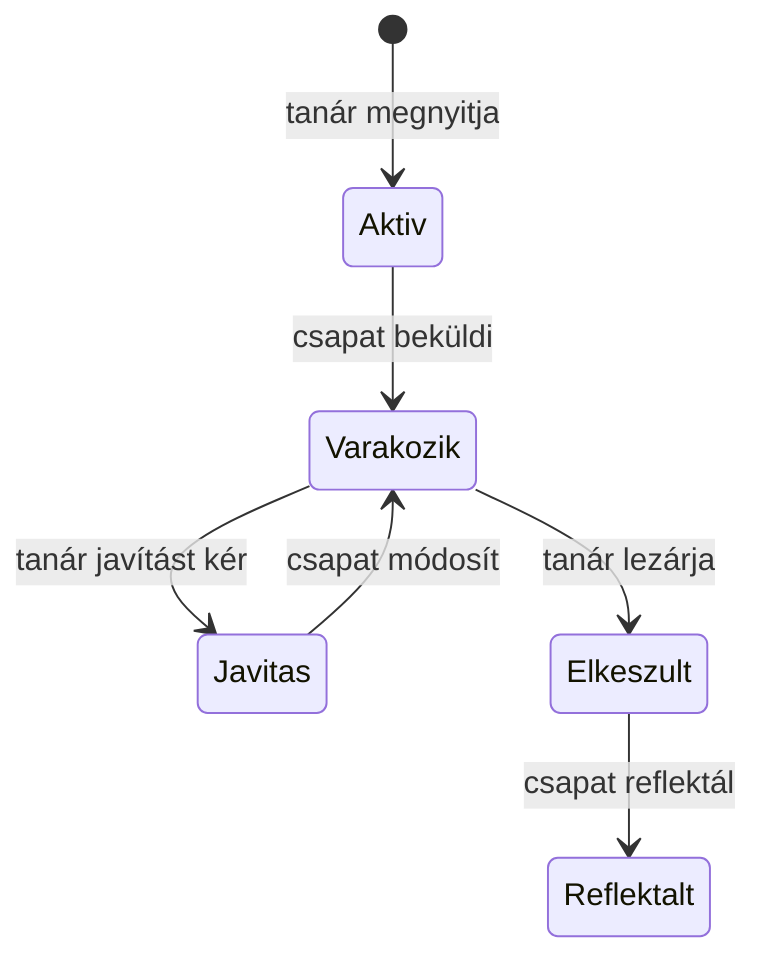

### Tanári visszajelzési sor

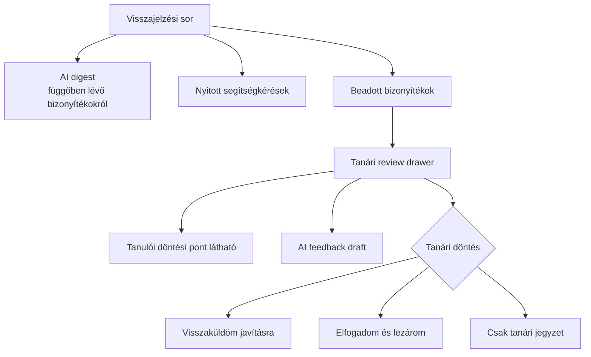

**Fontos AI-szabály:** az AI nem küld visszajelzést. Draftot vagy kérdéseket ad, a végső döntés és szöveg a tanáré.

---

## 7. AI szerepe vizuálisan

> Koncepciókapcsolat: az AI itt pedagógiai támasz, nem automata döntéshozó. Ez közvetlenül követi a [Matricás Album termékvízió](https://gdemikk.atlassian.net/wiki/spaces/AI/pages/722370562/Matric+s+Album+-+Term+kv+zi) technológiai szerepét és a [Lauder AI-visszajelzés](https://gdemikk.atlassian.net/wiki/spaces/DPA/pages/709296137/2026-05-20+Lauder+-+Lecke+bemutat+sa) óvatosságát.

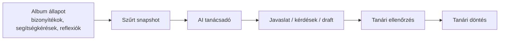

### Hol jelenik meg AI?

| Hely | Mit ad? | Ki dönt? |
|---|---|---|
| Futó album | Tanári tanácsok, mikromatrica-javaslat | Tanár |
| Visszajelzési sor | Függőben lévő bizonyítékok összegzése | Tanár |
| Bizonyíték review | Szerkeszthető feedback draft | Tanár |
| Segítségkérés | Socratikus tanári kérdésötletek | Tanár |
| Diák aktuális matrica | Gondolkodtató kérdések | Diák + tanár |

### AI használati féklámpa

| Jelzés | Használat |
|---|---|
| Zöld | Kérj összegzést, draftot, kérdésötletet |
| Sárga | Szerkeszd át saját tanári hangra |
| Piros | Ne engedd, hogy az AI értékeljen vagy pedagógiai döntést hozzon helyetted |

---

## 8. Differenciálás

> Koncepciókapcsolat: a differenciálási nézet az adaptív pedagógiai mozgástér első, pilotbarát megjelenése, amelyet a [termékvízió](https://gdemikk.atlassian.net/wiki/spaces/AI/pages/722370562/Matric+s+Album+-+Term+kv+zi) és a [Lauder visszajelzés](https://gdemikk.atlassian.net/wiki/spaces/DPA/pages/709296137/2026-05-20+Lauder+-+Lecke+bemutat+sa) is hangsúlyoz.

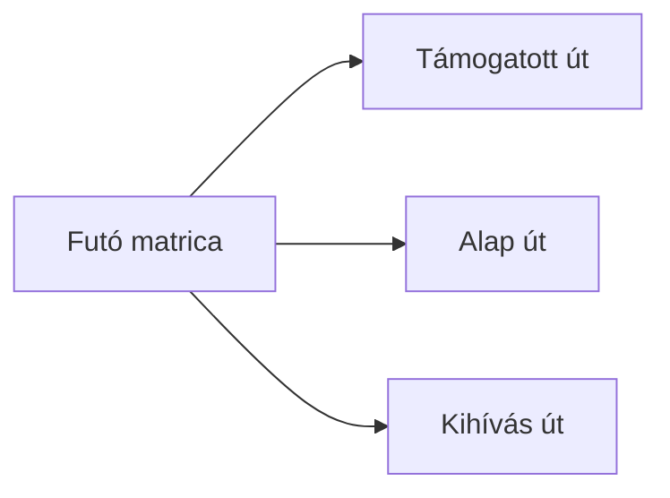

| Út | Kinek jó? | Mit ad? |
|---|---|---|
| Támogatott út | Bizonytalanabb vagy több támaszt igénylő csapat | Sablon, ellenőrzőlista, kijelölt részfeladat |
| Alap út | A csapatok többsége | Önálló választás, normál munkamenet |
| Kihívás út | Gyorsabban haladó, erősebb csapat | Mélyebb összehasonlítás, saját protokoll, komplexebb produktum |

**Jelenlegi működés:** a differenciálási utak fázis szerint szerkeszthetők, és a tanár futó matricánként, csapatonként választhat támogatott, alap vagy kihívás útvonalat. Ez nem rangsor, hanem tanári adaptációs döntés.

---

## 9. Projektzárás

> Koncepciókapcsolat: a Projektzárás a visszacsatolásból tanuló rendszer első konkrét felülete, lásd a [Matricás Album termékvízió learning-loop részét](https://gdemikk.atlassian.net/wiki/spaces/AI/pages/722370562/Matric+s+Album+-+Term+kv+zi).

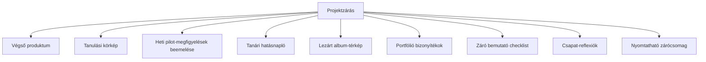

### Tanulási körkép

Ez egy leíró snapshot, nem pontszám.

| Mutató | Mit mond el? |
|---|---|
| Matricák állapota | Hány aktív / lezárt epizód van |
| Bizonyítékok | Mennyi látható tanulási nyom gyűlt össze |
| Segítségkérések | Hol kellett tanári beavatkozás |
| Visszajelzés és revízió | Történt-e tanári visszacsatolás és javítás |
| Reflexiók | Hány csapat és matrica kapott reflexiót |
| Záró checklist | Felkészültség a bemutatóra |
| Tanári hatásnapló | Van-e rögzített tanári utóreflexió |

### Heti pilot-megfigyelések beemelése

A futó album oldalán rögzített heti pilot-megfigyelések helyi jegyzetek. Projektzáráskor a rendszer jelzi, ha vannak ilyen jegyzetek az aktív futtatáshoz, és egy **Beemelés** gombbal átmásolhatók a tanári hatásnapló mezőibe.

Fontos: a beemelés még nem mentés. A tanár átnézi, szerkeszti, majd a **Hatásnapló mentése** gombbal teszi tartóssá.

### Tanári hatásnapló

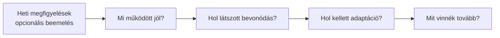

**Miért fontos?** Ez lesz a pilot tanári tanulási adata. Nem a diákokat rangsorolja, hanem azt rögzíti, mit érdemes megtartani vagy módosítani a következő futtatásban.

---

## 10. Gyors feladatútvonalak

### Új album indítása osztállyal

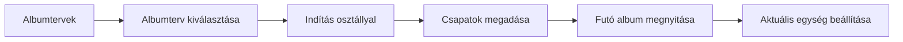

### Csapat bizonyítékának kezelése

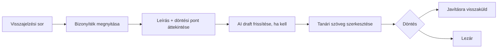

### Projektzáró anyag készítése

```mermaid
flowchart LR
    A["Projektzárás"] --> B["Tanulási körkép ellenőrzése"]
    B --> C["Tanári hatásnapló kitöltése"]
    C --> D["Checklist végigkattintása"]
    D --> E["Csapat-reflexiók ellenőrzése"]
    E --> F["Nyomtatható zárócsomag"]
```

---

## 11. Döntési fa: hova kattintsak?

```mermaid
flowchart TD
    START["Mit szeretnél csinálni?"] --> A{"Tervezés vagy futtatás?"}
    A -->|Tervezés| B{"Mekkora a következő lépés?"}
    B -->|Ötlet| C["Kezdj egy ötlettel"]
    B -->|Óra / blokk| D["Kezdj egy órával"]
    B -->|Tantervi váz| K["Kezdj egy tantervvel"]
    B -->|Meglévő anyag| L["Kezelés és visszakeresés"]
    A -->|Futtatás| E{"Mi sürgős?"}
    E -->|Beadás vár| F["Visszajelzési sor"]
    E -->|Csapatok| G["Csapatok"]
    E -->|Matrica állapot| H["Futó matricák"]
    E -->|Zárás| I["Projektzárás"]
    E -->|Nem tudom| J["Műhely prioritási sáv"]
```

---

## 12. Demo mód

```mermaid
flowchart LR
    A["Bemutató indítása"] --> B["Mikroklíma demo út"]
    B --> C["Matricák + albumterv"]
    C --> D["Futó album + csapatok"]
    D --> E["Diák bizonyíték + segítség"]
    E --> F["AI draft + tanári feedback"]
    F --> G["Reflexió + projektzárás"]
```

**Mikor használd?**

| Helyzet | Ajánlás |
|---|---|
| Belső demo | Használd a vezetett bemutatót |
| Tanári betanítás | Lépésenként mutasd: tanári oldal, diák oldal, visszajelzés, zárás |
| Valós pilot | Ne demo módból indulj, hanem saját albumtervből vagy meglévő mintából |

---

## 13. Gyakori félreértések

| Félreértés | Pontosítás |
|---|---|
| A matrica pont vagy badge | Nem. A matrica tanulási epizód, amely bizonyítékot termel |
| A tanárnak teljes tantervet kell építenie kezdéskor | Nem. Kezdhet egy ötlettel vagy egyetlen órai blokkal is |
| A tanulási egység már külön adminisztrálandó objektum | Nem. Most elhelyezési és gondolkodási keret, a későbbi hierarchia előképe |
| Az AI megírja a pedagógiát | Nem. Az AI segít, a tanár dönt |
| A differenciálás külön projektet jelent | Nem. Közös albumon belüli eltérő támasz vagy kihívás |
| A projektzárás csak export | Nem. A zárás tanulási körkép, heti megfigyelések beemelése és tanári hatásnapló is |
| A diák csak bead | Nem. Választ, cselekszik, segítséget kérhet, reflektál |

---

## 14. Egyoldalas használati puskázó

```text
1. Műhely
   Nézd meg, mit javasol a prioritási sáv, majd válassz belépési utat.

2. Belépési út
   Ötletből tevékenység (matrica), órából blokk-vázlat, tantervből tantervi vázlat.

3. Albumterv
   Tervezd meg a tanulási utat: vezérkérdés, egységek, tevékenységek, reflexió.

4. Futó album
   Indítsd el osztállyal, állítsd be a csapatokat és az aktuális egységet.

5. Aktív matrica
   A diákok választanak, dolgoznak, bizonyítékot küldenek be.

6. Visszajelzési sor
   Nézd át a bizonyítékokat. AI draft segíthet, de Te döntesz.

7. Reflexió
   A csapatok rögzítik, hogyan változott a gondolkodásuk.

8. Projektzárás
   Emeld be a heti megfigyeléseket, nézd meg a tanulási körképet, töltsd ki a hatásnaplót, exportálj.
```

### A legfontosabb mondat tanároknak

> Nem azt mérjük, hogy ki gyűjtött több matricát, hanem azt tesszük láthatóvá, hogyan halad egy csapat a kérdéstől a bizonyítékon és visszajelzésen át a reflexióig.
